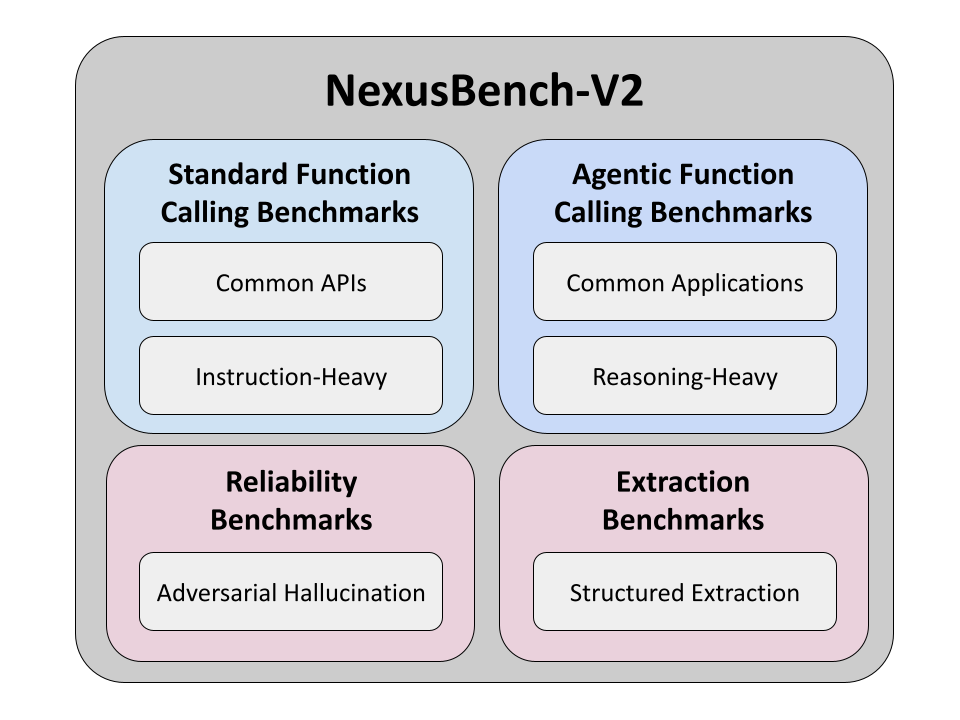

# NexusBench
Nexusflow function call, tool use, and agent benchmarks.

- [NexusBench](#nexusbench)
- [Setup](#setup)
- [Nexusbench options](#nexusbench-options)
  - [Documentation](#documentation)
- [Overview](#overview)
- [Features](#features)
- [Chat benchmarks](#chat-benchmarks)
  - [Citations](#citations)
- [Contributing](#contributing)
  - [Adding New Clients](#adding-new-clients)
  - [Adding New Benchmarks](#adding-new-benchmarks)





# Setup
```bash
conda create -y -n nexusbench python=3.11 && conda activate nexusbench
pip install uv && uv pip install -e .

nexusbench --discover

nexusbench \
    --client OpenAI \
    --base_url https://api.openai.com/v1 \
    --api_key <OPENAI_API_KEY> \
    --model gpt-4o \
    --benchmarks NVDLibraryBenchmark VirusTotalBenchmark ITType0Benchmark ITType1Benchmark TicketTracking
```

# Nexusbench options
```bash
  --discover            Prints all benchmarks and their purposes
  --num_benchmarks_parallel NUM_BENCHMARKS_PARALLEL
                        How many benchmarks to run in parallel
  --num_samples_parallel NUM_SAMPLES_PARALLEL
                        How many samples to run in parallel per benchmark
  --client {OpenAI,Anthropic,Mistral,Qwen}
                        The client to use for running the benchmarks
  --base_url BASE_URL   The base url for the inference backend used by the client.
  --api_key API_KEY     API key for the model (if required)
  --model MODEL         Specific model name to use
  --suite {per_task,hallucination,instruction-following,fc-v2,langchain-simple,langchain-hard,ftagent-v2,all}
                        Specific benchmark suite to run or 'all' for all suites
  --benchmarks {NVDLibraryBenchmark,VirusTotalBenchmark,ITType0Benchmark,ITType1Benchmark,TicketTracking,...all} 
                        Specific benchmarks in addition to the suite benchmarks to run (space-separated) or
                        'all' for all benchmarks
  --upload              Upload predictions to Hugging Face
  --limit LIMIT         Limit the number of samples per benchmark
  --debug               Print error traceback or just the error repr.
```

## Documentation

1. [benchmarks.md](docs/benchmarks.md): Descriptions of the benchmarks included in this repository.


# Overview

The main components of this benchmarking system are:

1. `entrypoint.py`: The entry point for running benchmarks.
2. `prompters.py`: Contains different prompting strategies for various models.
3. `clients.py`: Implements API clients for different language models.
4. `benchmarks.py`: Defines benchmark classes and sample structures.
5. `config.py`: Configuration file for models and benchmarks.


# Features

- Support for multiple language models (OpenAI, Anthropic, Mistral, Raven)
- Function calling capabilities for supported models
- Customizable prompting strategies (tool use API, Pythonic/Prompted, etc.)
- Easy addition of new benchmarks and models

The system will output benchmark results in a tabulated format, showing the accuracy for each benchmark and an overall average.


# Chat benchmarks

Below are papers and Github repositories for benchmarks that were used to evaluate Athene-V2-Chat and Athene-V2-Agent.
The Github repository links below are the corresponding ones used for our benchmarks.

1. Arena-Hard
   1. Paper: https://arxiv.org/abs/2406.11939
   2. Github: https://github.com/lmarena/arena-hard-auto
2. Bigcode-Bench Hard
   1. Paper: https://arxiv.org/abs/2406.15877
   2. Github: https://github.com/bigcode-project/bigcodebench
3. MATH
   1. Paper: https://arxiv.org/abs/2103.03874
   2. Github: https://huggingface.co/datasets/hendrycks/competition_math
4. IFEval Prompt
   1. Paper: https://arxiv.org/abs/2311.07911
   2. Github: https://github.com/google-research/google-research/tree/master/instruction_following_eval
5. GPQA
   1. Paper: https://arxiv.org/abs/2311.12022
   2. Github: https://github.com/idavidrein/gpqa/
6. MMLU-Pro
   1. Paper: https://arxiv.org/abs/2406.01574
   2. Github: https://github.com/TIGER-AI-Lab/MMLU-Pro


## Citations
Thank you so much to the amazing authors and their contributions cited below!
```
@article{li2024crowdsourced,
    title={From Crowdsourced Data to High-Quality Benchmarks: Arena-Hard and BenchBuilder Pipeline},
    author={Li, Tianle and Chiang, Wei-Lin and Frick, Evan and Dunlap, Lisa and Wu, Tianhao and Zhu, Banghua and Gonzalez, Joseph E and Stoica, Ion},
    journal={arXiv preprint arXiv:2406.11939},
    year={2024}
}
@misc{chiang2024chatbot,
    title={Chatbot Arena: An Open Platform for Evaluating LLMs by Human Preference},
    author={Wei-Lin Chiang and Lianmin Zheng and Ying Sheng and Anastasios Nikolas Angelopoulos and Tianle Li and Dacheng Li and Hao Zhang and Banghua Zhu and Michael Jordan and Joseph E. Gonzalez and Ion Stoica},
    year={2024},
    eprint={2403.04132},
    archivePrefix={arXiv},
    primaryClass={cs.AI}
}
@misc{arenahard2024,
    title = {From Live Data to High-Quality Benchmarks: The Arena-Hard Pipeline},
    url = {https://lmsys.org/blog/2024-04-19-arena-hard/},
    author = {Tianle Li*, Wei-Lin Chiang*, Evan Frick, Lisa Dunlap, Banghua Zhu, Joseph E. Gonzalez, Ion Stoica},
    month = {April},
    year = {2024}
}
@article{zhuo2024bigcodebench,
    title={BigCodeBench: Benchmarking Code Generation with Diverse Function Calls and Complex Instructions},
    author={Zhuo, Terry Yue and Vu, Minh Chien and Chim, Jenny and Hu, Han and Yu, Wenhao and Widyasari, Ratnadira and Yusuf, Imam Nur Bani and Zhan, Haolan and He, Junda and Paul, Indraneil and others},
    journal={arXiv preprint arXiv:2406.15877},
    year={2024}
}
@article{hendrycksmath2021,
    title={Measuring Mathematical Problem Solving With the MATH Dataset},
    author={Dan Hendrycks
    and Collin Burns
    and Saurav Kadavath
    and Akul Arora
    and Steven Basart
    and Eric Tang
    and Dawn Song
    and Jacob Steinhardt},
    journal={arXiv preprint arXiv:2103.03874},
    year={2021}
}
@article{zhou2023instruction,
    title={Instruction-Following Evaluation for Large Language Models},
    author={Zhou, Jeffrey and Lu, Tianjian and Mishra, Swaroop and Brahma, Siddhartha and Basu, Sujoy and Luan, Yi and Zhou, Denny and Hou, Le},
    journal={arXiv preprint arXiv:2311.07911},
    year={2023}
}
@misc{langchainbenchmarks2024,
   title={LangChain Benchmarks},
   author={LangChain AI},
   year={2024},
   howpublished={\url{https://github.com/langchain-ai/langchain-benchmarks}}
}
@inproceedings{rein2024gpqa,
    title={{GPQA}: A Graduate-Level Google-Proof Q\&A Benchmark},
    author={David Rein and Betty Li Hou and Asa Cooper Stickland and Jackson Petty and Richard Yuanzhe Pang and Julien Dirani and Julian Michael and Samuel R. Bowman},
    booktitle={First Conference on Language Modeling},
    year={2024},
    url={https://openreview.net/forum?id=Ti67584b98}
}
@article{wang2024mmlu,
    title={Mmlu-pro: A more robust and challenging multi-task language understanding benchmark},
    author={Wang, Yubo and Ma, Xueguang and Zhang, Ge and Ni, Yuansheng and Chandra, Abhranil and Guo, Shiguang and Ren, Weiming and Arulraj, Aaran and He, Xuan and Jiang, Ziyan and others},
    journal={arXiv preprint arXiv:2406.01574},
    year={2024}
}
```

# Contributing

Contributions to improve the benchmarking system or add new models/benchmarks are welcome. Please submit a pull request with your changes.

When contributing new benchmarks or models, please note:

- The `get_json_representation` method in benchmark classes is used to provide a JSON representation of the tools for models that support function calling (e.g., OpenAI, Anthropic). This allows the system to use the ToolAPI format for these models, while still supporting the traditional pythonic prompting format for other models.
- When adding new models, consider whether they support function calling and implement the appropriate prompting strategy in the corresponding prompter class.

## Adding New Clients

To add a new client:

1. Create a new prompter class in `prompters.py`
2. Implement a new client class in `clients.py`
3. Add the client configuration to `CLIENTS` in `config.py`

## Adding New Benchmarks

To add a new benchmark:

1. Create a new benchmark class in `benchmarks.py`
2. Implement the required methods: `get_samples()`, `tools`, `get_json_representation`
3. Add the benchmark to the `BENCHMARKS` list in `config.py`
